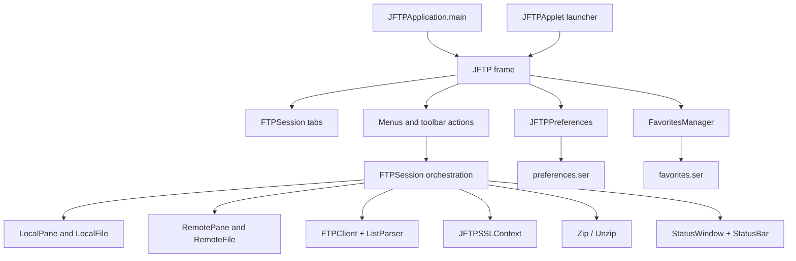

# Application architecture and modernization boundaries

This is a source-based description of the current JFTP application. It is not a claim that the project compiles or runs on a current JDK; no build or runtime verification was performed. Source links are relative to this document.

## Runtime shape

The executable desktop entry point is `JFTPApplication.main`, which configures locale and look and feel, applies macOS menu integration when detected, creates the `JFTP` frame, shows it, and opens one `FTPSession` ([JFTPApplication.java](../src/main/java/com/myjavaworld/jftp/JFTPApplication.java#L22)). `JFTP` owns the top-level menus, toolbar, tabbed sessions, preference persistence, and current-tab dispatch ([JFTP.java](../src/main/java/com/myjavaworld/jftp/JFTP.java#L62)). `JFTPApplet` is a separate legacy launcher which shows a button that opens a desktop `JFTP` frame in applet mode ([JFTPApplet.java](../src/main/java/com/myjavaworld/jftp/JFTPApplet.java#L30)). Modern browser applet deployment is not established; retain this source and treat its runtime target as an explicit compatibility question.

Each `FTPSession` contains local and remote browser panes, a protocol transcript window, and a status bar. It keeps the current `FTPClient`, listing parser, local and remote working directories, filters, transfer-mode choice, abort flag, monitor state, and progress counters ([FTPSession.java](../src/main/java/com/myjavaworld/jftp/FTPSession.java#L70)). The main frame routes menu commands to the currently selected tab, so active-tab selection and per-session transfer state are user-visible contracts ([JFTP.java](../src/main/java/com/myjavaworld/jftp/JFTP.java#L168)).

The connection boundary is the external `com.myjavaworld.ftp.FTPClient` API. `FTPSession.connect` reflectively constructs the selected client and `ListParser`, configures passive mode, timeout, buffer size, SSL mode and data-channel encryption, installs listeners, connects, logs in, issues configured commands, chooses the initial remote directory, and lists it ([FTPSession.java](../src/main/java/com/myjavaworld/jftp/FTPSession.java#L617)). The source uses FTP and FTP over SSL/TLS (explicit, implicit, or SSL-if-available modes); it contains no SFTP client or SFTP protocol path. The FTP API artifact's current availability and redistribution rights remain unverified; preserve its adapter boundary until those questions are resolved.

## Operation and event flow

Connection, listing, recursive transfer, remote file operations, and most local filesystem operations use the project-owned `com.myjavaworld.gui.SwingWorker`: blocking work runs in `construct()` and results typically update panes in `finished()` ([FTPSession.java](../src/main/java/com/myjavaworld/jftp/FTPSession.java#L617), [support-library analysis](support-libraries.md)). `finished()` is the UI completion boundary. FTP control/data callbacks update the transcript, status indicators, transfer counters and toolbar directly ([FTPSession.java](../src/main/java/com/myjavaworld/jftp/FTPSession.java#L518)); callbacks can therefore touch Swing components from the FTP library's callback thread. Timer actions also update progress, speed and elapsed-time labels ([FTPSession.java](../src/main/java/com/myjavaworld/jftp/FTPSession.java#L229)). Local rename is synchronous, while recursive upload/download methods are called inside worker contexts by their usual callers. Treat these mixed thread paths as existing behavior and a thread-safety risk to characterize before replacing the worker abstraction.

Uploads and downloads call `FTPClient.upload` and `FTPClient.download` with an ASCII or binary transfer type selected per-session or from the extension map/default preference ([FTPSession.java](../src/main/java/com/myjavaworld/jftp/FTPSession.java#L745), [FTPSession.java](../src/main/java/com/myjavaworld/jftp/FTPSession.java#L884)). Recursive directory transfer creates corresponding directories and walks filtered children. Downloads write files under the local working directory; uploads write under the remote working directory. “As” operations substitute the selected file's destination name. Abort sets a session flag, calls `FTPClient.abort()` asynchronously, and the recursion loops check the flag between items; the protocol callback records transfer-aborted state ([AbortAction.java](../src/main/java/com/myjavaworld/jftp/actions/AbortAction.java#L65), [FTPSession.java](../src/main/java/com/myjavaworld/jftp/FTPSession.java#L560), [FTPSession.java](../src/main/java/com/myjavaworld/jftp/FTPSession.java#L714)). A file already in progress depends on FTPAPI abort behavior.

Opening, editing, or printing a remote file first downloads it to a temporary file. Open/edit/print with monitoring registers that temp file with `FileChangeMonitor`; when it changes, the user is asked whether to upload the edited file to its original remote path ([FTPSession.java](../src/main/java/com/myjavaworld/jftp/FTPSession.java#L153), [OpenRemoteFileAction.java](../src/main/java/com/myjavaworld/jftp/actions/OpenRemoteFileAction.java#L76)). The ordinary file association/print/edit handoff delegates to `java.awt.Desktop`; support varies by operating system. Local open/edit/print use `Desktop` directly. ZIP workflows download before extracting or zip selected local files before upload, with progress events reflected in the same session status bar ([DownloadAndUnzipAction.java](../src/main/java/com/myjavaworld/jftp/actions/DownloadAndUnzipAction.java#L51), [ZipAndUploadAction.java](../src/main/java/com/myjavaworld/jftp/actions/ZipAndUploadAction.java#L65)).

The status transcript separates commands, replies, errors, status and informational messages, and truncates its document after 16 KiB ([StatusWindow.java](../src/main/java/com/myjavaworld/jftp/StatusWindow.java#L43)). The status bar displays activity, progress, elapsed time, speed and a secured-connection icon ([StatusBar.java](../src/main/java/com/myjavaworld/jftp/StatusBar.java#L87)).

## Persisted state and security boundary

`JFTP.DATA_HOME` is `${user.home}/.jftp/data`. The global `JFTPPreferences` bean is serialized to `preferences.ser`; it includes UI, language, local directory, transfer types, network proxy credentials, connection defaults, certificate-store paths/passwords, update preference, window bounds and license-version state ([JFTP.java](../src/main/java/com/myjavaworld/jftp/JFTP.java#L66), [JFTP.java](../src/main/java/com/myjavaworld/jftp/JFTP.java#L510), [JFTPPreferences.java](../src/main/java/com/myjavaworld/jftp/JFTPPreferences.java#L40)). Favorites are serialized separately to `favorites.ser`. They include remote credentials and settings. The manager wraps favorites with AES using an embedded fixed key, with a plaintext fallback; this is reversible obfuscation, not a secure credential store ([FavoritesManager.java](../src/main/java/com/myjavaworld/jftp/FavoritesManager.java#L112), [tls and persistence analysis](tls-and-persistence.md)). Never use a developer profile's persisted data as a test fixture.

TLS setup asks `JFTPSSLContext` for a per-host context before connecting. The trust manager may prompt during the TLS handshake, compares the certificate's leaf common name with the host, and caches accepted chain material only in the current manager; permanent trust installation is a separate action. Current validation defects and migration policy are documented in [TLS and persistence](tls-and-persistence.md). Do not turn unsafe current behavior into the target security contract; characterize the prompt/state transition, then add explicit fail-first security-fix cases.

## Compatibility questions and ordered change boundaries

The source exposes three compatibility questions that must remain explicit: the legacy applet launcher, direct legacy macOS EAWT imports in `OSXAdapterOld`, and the external FTPAPI artifact. A current JDK 26 removes applet APIs, so a Java 25 LTS target is the proposed first supported ceiling if retaining the applet source is required; deleting or replacing the applet needs a user decision. The reflective `OSXAdapter` is the active desktop path, while the directly imported `OSXAdapterOld` may prevent compilation when Apple's old EAWT classes are unavailable. Do not remove either adapter without compiling and checking macOS menu behavior.

Recommended order follows a tests-first implementation. First design and write the four behavioral suites in [regression-test design](regression-test-design.md). If the legacy build cannot compile, make only the narrow compiler/tool/dependency bootstrap changes needed to make a baseline executable; then capture baseline output and get the tests passing before launcher/startup fixes or broader changes. Resolve FTPAPI availability and licensing before replacement. Reconcile assembly output and Windows/Unix launch scripts only after those behavior checks pass. Keep serialized state migration, TLS policy changes, ZIP path safety, and Swing worker replacement in distinct phases. The application behavior index is in [application workflows](application-workflows.md); shared structure and behavior changes must update those docs and the applicable root/nested agent instructions in the same change.
